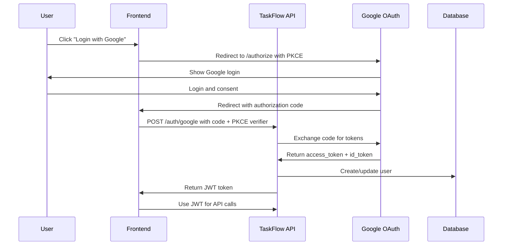

# OAuth 2.0 Implementation Guide - TaskFlow API

## 🎯 Overview
This guide walks through implementing Google OAuth 2.0 in the TaskFlow API using .NET Identity and the Authorization Code Flow with PKCE.

## 🔐 OAuth 2.0 Flow Overview



## 🛠️ Step 1: Google Cloud Console Setup

### 1.1 Create Google Cloud Project
1. Go to [Google Cloud Console](https://console.cloud.google.com/)
2. Create a new project or select existing one
3. Enable the Google+ API and Google OAuth2 API

### 1.2 Configure OAuth 2.0 Credentials
1. Navigate to **APIs & Services** > **Credentials**
2. Click **Create Credentials** > **OAuth 2.0 Client IDs**
3. Configure the OAuth consent screen:
   - **Application type**: Web application
   - **Name**: TaskFlow API
   - **Authorized redirect URIs**: 
     - `https://localhost:7001/signin-google` (development)
     - `https://your-domain.com/signin-google` (production)

### 1.3 Save Credentials
- **Client ID**: Copy for later use
- **Client Secret**: Copy for later use
- **Project ID**: Note for configuration

## 🔧 Step 2: TaskFlow API Configuration

### 2.1 Install Required Packages

```bash
cd taskflow-api-dotnet
dotnet add src/TaskFlow.API/TaskFlow.API.csproj package Microsoft.AspNetCore.Authentication.Google
dotnet add src/TaskFlow.API/TaskFlow.API.csproj package Microsoft.AspNetCore.Identity
dotnet add src/TaskFlow.API/TaskFlow.API.csproj package Microsoft.AspNetCore.Identity.EntityFrameworkCore
```

### 2.2 Update appsettings.json

```json
{
  "Authentication": {
    "Google": {
      "ClientId": "your-google-client-id",
      "ClientSecret": "your-google-client-secret"
    },
    "Jwt": {
      "SecretKey": "your-super-secret-key-with-at-least-256-bits",
      "Issuer": "TaskFlow-API",
      "Audience": "TaskFlow-Users",
      "ExpirationMinutes": 60
    }
  }
}
```

### 2.3 Update Program.cs

```csharp
// Add Identity services
builder.Services.AddIdentity<ApplicationUser, IdentityRole>(options =>
{
    options.Password.RequireDigit = true;
    options.Password.RequireLowercase = true;
    options.Password.RequireUppercase = true;
    options.Password.RequireNonAlphanumeric = true;
    options.Password.RequiredLength = 8;
})
.AddEntityFrameworkStores<TaskFlowDbContext>()
.AddDefaultTokenProviders();

// Configure Google OAuth
builder.Services.AddAuthentication()
    .AddGoogle(options =>
    {
        options.ClientId = builder.Configuration["Authentication:Google:ClientId"];
        options.ClientSecret = builder.Configuration["Authentication:Google:ClientSecret"];
        options.UsePkce = true; // Enable PKCE for SPAs
        options.CallbackPath = "/signin-google";
        
        // Configure scopes
        options.Scope.Add("openid");
        options.Scope.Add("profile");
        options.Scope.Add("email");
    })
    .AddJwtBearer(options =>
    {
        var jwtSettings = builder.Configuration.GetSection("Authentication:Jwt");
        var secretKey = Encoding.UTF8.GetBytes(jwtSettings["SecretKey"]!);

        options.TokenValidationParameters = new TokenValidationParameters
        {
            ValidateIssuerSigningKey = true,
            IssuerSigningKey = new SymmetricSecurityKey(secretKey),
            ValidateIssuer = true,
            ValidIssuer = jwtSettings["Issuer"],
            ValidateAudience = true,
            ValidAudience = jwtSettings["Audience"],
            ValidateLifetime = true,
            ClockSkew = TimeSpan.Zero
        };
    });

// Configure cookie authentication for OAuth
builder.Services.ConfigureApplicationCookie(options =>
{
    options.Cookie.Name = "TaskFlow.Auth";
    options.Cookie.HttpOnly = true;
    options.Cookie.SecurePolicy = CookieSecurePolicy.Always;
    options.Cookie.SameSite = SameSiteMode.Lax; // Required for OAuth redirects
    options.ExpireTimeSpan = TimeSpan.FromMinutes(60);
    options.SlidingExpiration = true;
});
```

## 👤 Step 3: Create ApplicationUser Model

### 3.1 Create ApplicationUser.cs

```csharp
// src/TaskFlow.Domain/Entities/ApplicationUser.cs
using Microsoft.AspNetCore.Identity;
using TaskFlow.Domain.ValueObjects;

namespace TaskFlow.Domain.Entities;

public class ApplicationUser : IdentityUser
{
    public string FirstName { get; set; } = string.Empty;
    public string LastName { get; set; } = string.Empty;
    public string? GoogleId { get; set; }
    public string? ProfilePictureUrl { get; set; }
    public DateTime CreatedAt { get; set; } = DateTime.UtcNow;
    public DateTime LastLoginAt { get; set; } = DateTime.UtcNow;
    
    // Navigation properties
    public virtual ICollection<TaskFlow.Domain.Entities.Task> AssignedTasks { get; set; } = new List<TaskFlow.Domain.Entities.Task>();
    public virtual ICollection<Project> OwnedProjects { get; set; } = new List<Project>();
}
```

### 3.2 Update TaskFlowDbContext

```csharp
// src/TaskFlow.Infrastructure/Persistence/TaskFlowDbContext.cs
using Microsoft.AspNetCore.Identity.EntityFrameworkCore;
using TaskFlow.Domain.Entities;

namespace TaskFlow.Infrastructure.Persistence;

public class TaskFlowDbContext : IdentityDbContext<ApplicationUser>
{
    public TaskFlowDbContext(DbContextOptions<TaskFlowDbContext> options) : base(options)
    {
    }

    public DbSet<TaskFlow.Domain.Entities.Task> Tasks { get; set; }
    public DbSet<Project> Projects { get; set; }

    protected override void OnModelCreating(ModelBuilder builder)
    {
        base.OnModelCreating(builder);
        
        // Configure ApplicationUser
        builder.Entity<ApplicationUser>(entity =>
        {
            entity.Property(e => e.FirstName).HasMaxLength(100);
            entity.Property(e => e.LastName).HasMaxLength(100);
            entity.Property(e => e.GoogleId).HasMaxLength(100);
            entity.Property(e => e.ProfilePictureUrl).HasMaxLength(500);
        });

        // Existing configurations...
    }
}
```

## 🔐 Step 4: Create Authentication Controller

### 4.1 Create AuthController.cs

```csharp
// src/TaskFlow.API/Controllers/AuthController.cs
using Microsoft.AspNetCore.Authentication;
using Microsoft.AspNetCore.Identity;
using Microsoft.AspNetCore.Mvc;
using System.Security.Claims;
using System.Text;
using Microsoft.IdentityModel.Tokens;
using System.IdentityModel.Tokens.Jwt;
using TaskFlow.Domain.Entities;

namespace TaskFlow.API.Controllers;

[ApiController]
[Route("api/[controller]")]
public class AuthController : ControllerBase
{
    private readonly UserManager<ApplicationUser> _userManager;
    private readonly SignInManager<ApplicationUser> _signInManager;
    private readonly IConfiguration _configuration;
    private readonly ILogger<AuthController> _logger;

    public AuthController(
        UserManager<ApplicationUser> userManager,
        SignInManager<ApplicationUser> signInManager,
        IConfiguration configuration,
        ILogger<AuthController> logger)
    {
        _userManager = userManager;
        _signInManager = signInManager;
        _configuration = configuration;
        _logger = logger;
    }

    [HttpGet("google-login")]
    public IActionResult GoogleLogin(string returnUrl = "/")
    {
        var properties = _signInManager.ConfigureExternalAuthenticationProperties("Google", returnUrl);
        return Challenge(properties, "Google");
    }

    [HttpGet("google-callback")]
    public async Task<IActionResult> GoogleCallback()
    {
        var info = await _signInManager.GetExternalLoginInfoAsync();
        if (info == null)
        {
            return BadRequest("External login info not found");
        }

        var signInResult = await _signInManager.ExternalLoginSignInAsync(info.LoginProvider, info.ProviderKey, isPersistent: false, bypassTwoFactor: true);
        
        if (signInResult.Succeeded)
        {
            var user = await _userManager.FindByLoginAsync(info.LoginProvider, info.ProviderKey);
            var token = GenerateJwtToken(user);
            return Ok(new { token, user = new { user.Id, user.Email, user.FirstName, user.LastName } });
        }

        // User doesn't exist, create new user
        var email = info.Principal.FindFirstValue(ClaimTypes.Email);
        var firstName = info.Principal.FindFirstValue(ClaimTypes.GivenName) ?? "";
        var lastName = info.Principal.FindFirstValue(ClaimTypes.Surname) ?? "";
        var googleId = info.Principal.FindFirstValue(ClaimTypes.NameIdentifier);
        var profilePicture = info.Principal.FindFirstValue("picture");

        var user = new ApplicationUser
        {
            UserName = email,
            Email = email,
            FirstName = firstName,
            LastName = lastName,
            GoogleId = googleId,
            ProfilePictureUrl = profilePicture,
            EmailConfirmed = true
        };

        var createResult = await _userManager.CreateAsync(user);
        if (!createResult.Succeeded)
        {
            return BadRequest("Failed to create user");
        }

        var addLoginResult = await _userManager.AddLoginAsync(user, info);
        if (!addLoginResult.Succeeded)
        {
            return BadRequest("Failed to add external login");
        }

        await _signInManager.SignInAsync(user, isPersistent: false);
        var token = GenerateJwtToken(user);
        
        return Ok(new { token, user = new { user.Id, user.Email, user.FirstName, user.LastName } });
    }

    [HttpPost("logout")]
    public async Task<IActionResult> Logout()
    {
        await _signInManager.SignOutAsync();
        return Ok("Logged out successfully");
    }

    [HttpGet("me")]
    [Authorize]
    public async Task<IActionResult> GetCurrentUser()
    {
        var user = await _userManager.GetUserAsync(User);
        if (user == null)
        {
            return NotFound("User not found");
        }

        return Ok(new
        {
            user.Id,
            user.Email,
            user.FirstName,
            user.LastName,
            user.ProfilePictureUrl,
            user.CreatedAt,
            user.LastLoginAt
        });
    }

    private string GenerateJwtToken(ApplicationUser user)
    {
        var jwtSettings = _configuration.GetSection("Authentication:Jwt");
        var secretKey = Encoding.UTF8.GetBytes(jwtSettings["SecretKey"]!);
        var key = new SymmetricSecurityKey(secretKey);
        var creds = new SigningCredentials(key, SecurityAlgorithms.HmacSha256);

        var claims = new[]
        {
            new Claim(ClaimTypes.NameIdentifier, user.Id),
            new Claim(ClaimTypes.Email, user.Email),
            new Claim(ClaimTypes.Name, $"{user.FirstName} {user.LastName}"),
            new Claim("sub", user.Id),
            new Claim("email", user.Email)
        };

        var token = new JwtSecurityToken(
            issuer: jwtSettings["Issuer"],
            audience: jwtSettings["Audience"],
            claims: claims,
            expires: DateTime.UtcNow.AddMinutes(Convert.ToDouble(jwtSettings["ExpirationMinutes"])),
            signingCredentials: creds
        );

        return new JwtSecurityTokenHandler().WriteToken(token);
    }
}
```

## 🧪 Step 5: Testing OAuth Flow

### 5.1 Test with Postman

1. **Start the OAuth Flow**:
   ```
   GET https://localhost:7001/api/auth/google-login
   ```

2. **Handle the Redirect**:
   - Postman will show the Google OAuth page
   - Complete the login flow
   - You'll be redirected to the callback URL

3. **Get the JWT Token**:
   ```
   GET https://localhost:7001/api/auth/me
   Authorization: Bearer <your-jwt-token>
   ```

### 5.2 Test with Frontend (React Example)

```javascript
// Frontend OAuth implementation
const handleGoogleLogin = () => {
  window.location.href = 'https://localhost:7001/api/auth/google-login';
};

// Handle callback
const handleCallback = async () => {
  const urlParams = new URLSearchParams(window.location.search);
  const token = urlParams.get('token');
  
  if (token) {
    localStorage.setItem('authToken', token);
    // Redirect to dashboard
  }
};
```

## 🔒 Step 6: Security Enhancements

### 6.1 Add PKCE Support for SPAs

```csharp
// In Program.cs, update Google configuration
builder.Services.AddAuthentication()
    .AddGoogle(options =>
    {
        options.ClientId = builder.Configuration["Authentication:Google:ClientId"];
        options.ClientSecret = builder.Configuration["Authentication:Google:ClientSecret"];
        options.UsePkce = true; // Critical for SPAs
        options.CallbackPath = "/signin-google";
        
        // Additional security
        options.SaveTokens = true;
        options.Events = new OAuthEvents
        {
            OnCreatingTicket = async context =>
            {
                // Log OAuth events
                _logger.LogInformation("OAuth ticket created for user: {Email}", 
                    context.Identity?.FindFirst(ClaimTypes.Email)?.Value);
            }
        };
    });
```

### 6.2 Add Token Validation Middleware

```csharp
// src/TaskFlow.API/Middleware/JwtMiddleware.cs
public class JwtMiddleware
{
    private readonly RequestDelegate _next;
    private readonly IConfiguration _configuration;

    public JwtMiddleware(RequestDelegate next, IConfiguration configuration)
    {
        _next = next;
        _configuration = configuration;
    }

    public async Task InvokeAsync(HttpContext context)
    {
        var token = context.Request.Headers["Authorization"].FirstOrDefault()?.Split(" ").Last();

        if (token != null)
        {
            try
            {
                var tokenHandler = new JwtSecurityTokenHandler();
                var key = Encoding.UTF8.GetBytes(_configuration["Authentication:Jwt:SecretKey"]!);
                
                tokenHandler.ValidateToken(token, new TokenValidationParameters
                {
                    ValidateIssuerSigningKey = true,
                    IssuerSigningKey = new SymmetricSecurityKey(key),
                    ValidateIssuer = true,
                    ValidIssuer = _configuration["Authentication:Jwt:Issuer"],
                    ValidateAudience = true,
                    ValidAudience = _configuration["Authentication:Jwt:Audience"],
                    ClockSkew = TimeSpan.Zero
                }, out SecurityToken validatedToken);

                var jwtToken = (JwtSecurityToken)validatedToken;
                var userId = jwtToken.Claims.First(x => x.Type == "nameid").Value;

                context.Items["User"] = userId;
            }
            catch (Exception ex)
            {
                // Token validation failed
                _logger.LogWarning("Token validation failed: {Error}", ex.Message);
            }
        }

        await _next(context);
    }
}
```

## 🚀 Step 7: Production Considerations

### 7.1 Environment Configuration

```json
// appsettings.Production.json
{
  "Authentication": {
    "Google": {
      "ClientId": "${GOOGLE_CLIENT_ID}",
      "ClientSecret": "${GOOGLE_CLIENT_SECRET}"
    },
    "Jwt": {
      "SecretKey": "${JWT_SECRET_KEY}",
      "Issuer": "https://api.taskflow.com",
      "Audience": "https://taskflow.com",
      "ExpirationMinutes": 60
    }
  }
}
```

### 7.2 Security Headers

```csharp
// Add to Program.cs
app.Use(async (context, next) =>
{
    context.Response.Headers["X-Content-Type-Options"] = "nosniff";
    context.Response.Headers["X-Frame-Options"] = "DENY";
    context.Response.Headers["X-XSS-Protection"] = "1; mode=block";
    context.Response.Headers["Referrer-Policy"] = "strict-origin-when-cross-origin";
    context.Response.Headers["Permissions-Policy"] = "geolocation=(), microphone=(), camera=()";
    await next();
});
```

## 📋 Checklist

- [ ] Google Cloud Console project created
- [ ] OAuth 2.0 credentials configured
- [ ] Required NuGet packages installed
- [ ] ApplicationUser model created
- [ ] TaskFlowDbContext updated
- [ ] AuthController implemented
- [ ] OAuth flow tested
- [ ] JWT token generation working
- [ ] Security headers added
- [ ] Environment variables configured
- [ ] PKCE enabled for SPAs
- [ ] Token validation middleware added

## 🔍 Troubleshooting

### Common Issues

1. **Redirect URI Mismatch**:
   - Ensure redirect URI in Google Console matches your application
   - Check for trailing slashes and protocol (http vs https)

2. **CORS Issues**:
   - Configure CORS properly for your frontend domain
   - Ensure credentials are included in requests

3. **Token Validation**:
   - Verify JWT secret key is properly configured
   - Check token expiration settings

4. **Database Migration**:
   - Run `dotnet ef migrations add AddIdentity`
   - Run `dotnet ef database update`

## 📚 Additional Resources

- [Google OAuth 2.0 Documentation](https://developers.google.com/identity/protocols/oauth2)
- [.NET Identity Documentation](https://docs.microsoft.com/en-us/aspnet/core/security/authentication/identity)
- [JWT.io](https://jwt.io/) - JWT token debugger
- [OAuth 2.0 Playground](https://oauth2.thephpleague.com/) - OAuth flow testing 